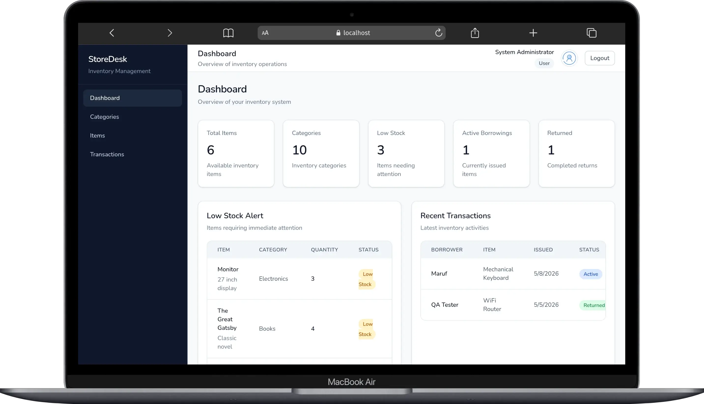
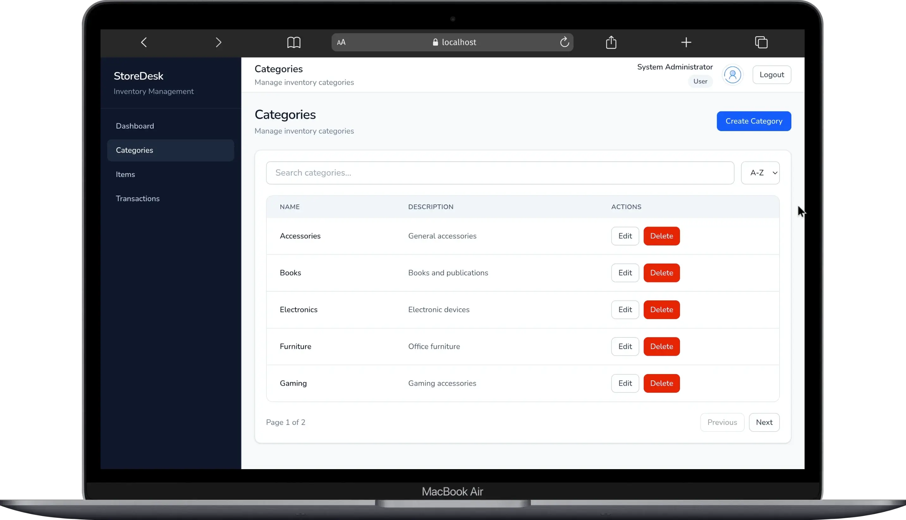
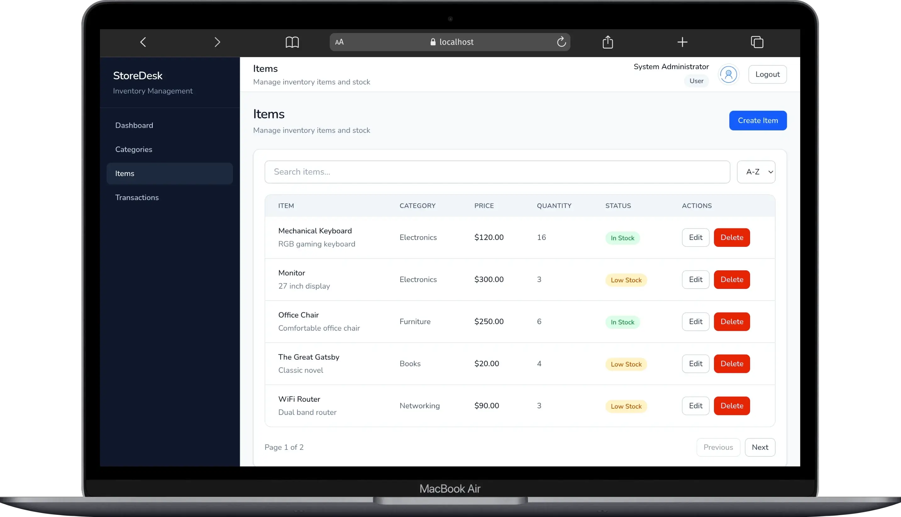
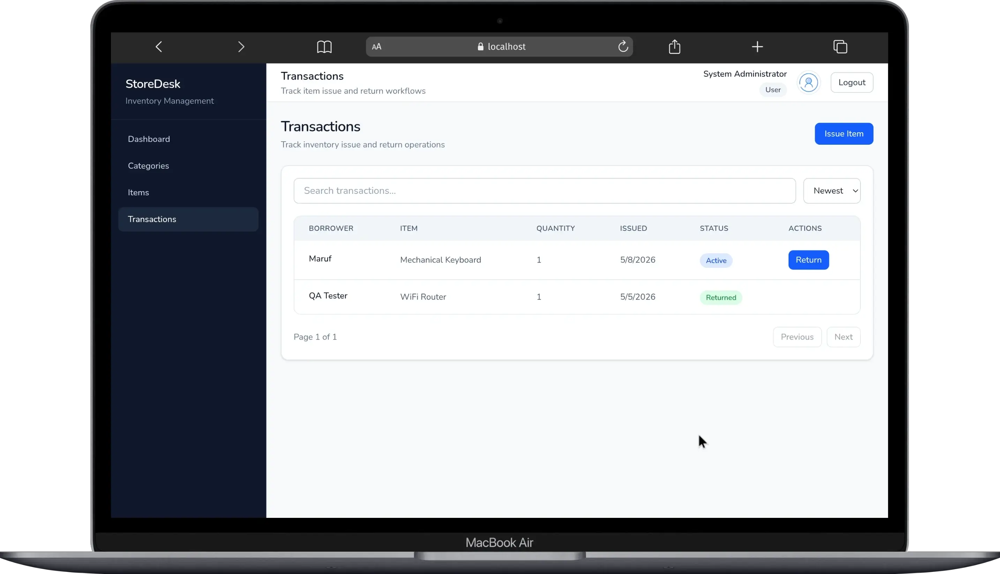

# StoreDesk

Modern fullstack inventory management system built with React, TypeScript, ASP.NET Core, PostgreSQL, and Docker.



## Features

### Authentication & Authorization

- JWT Authentication
- Role-based Authorization
- Protected Routes
- Persistent Login Sessions

### Inventory Management

- Categories CRUD
- Items CRUD
- Stock Tracking
- Low Stock Monitoring

### Transaction System

- Issue Items
- Return Items
- Active & Returned Transaction Tracking
- Automatic Stock Updates

### Dashboard

- Operational Dashboard
- Inventory Statistics
- Low Stock Alerts
- Recent Transactions
- Responsive Analytics Layout

### Frontend Architecture

- React + TypeScript
- Zustand State Management
- TanStack Query
- React Hook Form + Zod
- Optimistic Updates
- Reusable UI Components
- Responsive Admin Layout

### Backend Architecture

- ASP.NET Core Web API
- Entity Framework Core
- PostgreSQL
- Service Layer Architecture
- DTO Pattern
- Global Exception Middleware
- Standardized API Responses
- Seed Data System

## Screenshots

### Dashboard


### Categories



### Items



### Transactions



## Tech Stack

| Layer              | Technology            |
| ------------------ | --------------------- |
| Frontend           | React + TypeScript    |
| State Management   | Zustand               |
| Data Fetching      | TanStack Query        |
| Forms & Validation | React Hook Form + Zod |
| Styling            | Tailwind CSS          |
| Backend            | ASP.NET Core          |
| Database           | PostgreSQL            |
| ORM                | Entity Framework Core |
| Authentication     | JWT                   |
| Containerization   | Docker                |
| Build Tool         | Vite                  |

## Architecture Highlights

- Service-based backend architecture
- DTO-driven API design
- Standardized API response structure
- Global exception handling middleware
- JWT authentication with role authorization
- Reusable frontend component architecture
- Optimistic UI updates
- Responsive admin dashboard layout
- Reusable form and table systems
- Development seed data support

## Demo Credentials

### Admin

Email: `admin@storedesk.com`

Password: `Admin123!`

### QA User

Email: `qa@storedesk.com`

Password: `Qa123!`

### Developer User

Email: `dev@storedesk.com`

Password: `Dev123!`

## Project Structure

```txt
StoreDesk/
├── client/
│   ├── src/
│   ├── public/
│   └── Dockerfile
│
├── server/
│   └── StoreDesk.API/
│       ├── Controllers/
│       ├── Services/
│       ├── DTOs/
│       ├── Models/
│       ├── Data/
│       ├── Middleware/
│       └── Dockerfile
│
├── screenshots/
├── docker-compose.yml
└── README.md
```

## Local Development Setup

### Clone Repository

```bash
git clone https://github.com/maruf-pfc/storedesk-inventory-system.git
cd storedesk-inventory-system
```

## Backend Setup

```bash
cd server/StoreDesk.API

dotnet restore

dotnet ef database update

dotnet run
```

Backend runs on:

```txt
http://localhost:5196
```

## Frontend Setup

```bash
cd client

bun install

bun run dev
```

Frontend runs on:

```txt
http://localhost:5173
```

## Environment Variables

### Backend

Create:

```txt
server/StoreDesk.API/appsettings.Development.json
```

Example:

```json
{
  "ConnectionStrings": {
    "DefaultConnection": "YOUR_CONNECTION_STRING"
  },

  "Jwt": {
    "Key": "YOUR_SECRET_KEY",
    "Issuer": "StoreDeskAPI",
    "Audience": "StoreDeskClient",
    "DurationInMinutes": 60
  },

  "AdminUser": {
    "Email": "admin@storedesk.com",
    "Password": "Admin123!"
  }
}
```

## Frontend

Create:

```txt
client/.env
```

Example:

```env
VITE_API_BASE_URL=http://localhost:5196/api
```

## Docker Setup

Run the entire application using Docker:

```bash
docker compose up --build
```

## Docker Services

| Service    | Port |
| ---------- | ---- |
| Frontend   | 5173 |
| Backend    | 5196 |
| PostgreSQL | 5432 |

## Development Seed Data

Application automatically seeds:

- Roles
- Admin User
- Demo Users
- Categories
- Items
- Transactions

This provides a fully testable development environment immediately after startup.

## API Features

- Pagination-ready architecture
- Sorting-ready architecture
- Standardized API responses
- Validation middleware
- Global exception handling
- JWT authentication
- Role-based authorization

## Future Improvements

- Refresh Token Authentication
- Audit Logging
- Soft Delete Support
- Inventory Analytics Charts
- API Versioning
- Advanced Filtering
- Export Reports
- Dark Mode

## License

This project is built for educational and portfolio purposes.
